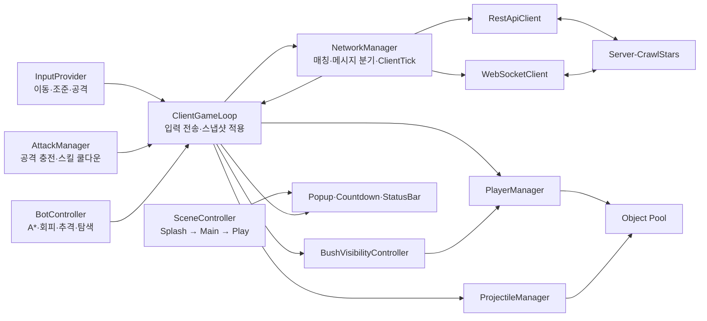

# Crawl Stars

> Unity 기반 서버 권위형 2D 실시간 멀티플레이 액션 클라이언트<br>
> 입력, 매치메이킹, 30Hz 스냅샷 동기화, 전투 표현, 봇 AI, UI, 성능 개선까지 클라이언트 전반 설계 및 구현

<p align="center">
  
  
  
  
</p>

<br/>

## 한눈에 보기

| 항목 | 내용                                                                                |
| --- |-----------------------------------------------------------------------------------|
| 개발 기간 | 2026년 5월 13일 ~ 진행 중                                                             |
| 담당 | Unity 클라이언트 구조, 게임플레이, 네트워크, UI, 봇, 최적화, 서버 연동                                    |
| 엔진 | Unity `6000.3.15f1`, URP 2D                                                       |
| 주요 기술 | C#, UniTask, REST, WebSocket, Addressables, Newtonsoft.Json, DOTween              |
| 서버 | [Second-Loop/Server-CrawlStars](https://github.com/Second-Loop/Server-CrawlStars) |

브롤스타즈의 짧고 즉각적인 전투 경험을 네트워크 게임 클라이언트 관점에서 재구성. 서버 상태의 안정적인 표현, 입력 지연과 런타임 할당 감소, 비동기 매칭과 씬 전환의 일관된 흐름에 집중.

<br/>

## 핵심 플레이 흐름

### 1. 인게임 코어 로직 flow


1. 클라이언트에서 매 프레임 이동 방향과 공격 방향 입력 수집
2. 30Hz `ClientTick`에 맞춰 입력을 서버로 전송
3. 서버에서 모든 클라이언트 입력을 수신해 플레이어와 투사체 시뮬레이션
4. 충돌·피격·사망·게임 종료 판정 후 전체 상태 snapshot 생성
5. snapshot을 모든 클라이언트에 전송
6. 클라이언트에서 플레이어와 투사체를 생성·갱신·회수하고 화면에 렌더링

<br/>

### 2. 매치메이킹 flow


1. 각 클라이언트에서 REST 매치메이킹 요청
2. 응답으로 받은 세션 정보와 경로를 사용해 WebSocket 연결
3. 인원 충족 후 서버의 `Ready` 메시지 수신
4. Play 씬으로 이동해 맵과 플레이어 로드·초기화
5. 초기화 완료 후 각 클라이언트에서 `ready` ACK 전송
6. 모든 클라이언트 준비 완료 시 `starting` snapshot 수신
7. 5초 카운트다운 후 `started` snapshot과 함께 인게임 루프 시작

<br/>

## 클라이언트 아키텍처



네트워크 계층은 전송과 메시지 해석, 게임 루프는 서버 상태 전달, 플레이어·투사체 매니저는 DTO의 Unity 오브젝트 투영 담당. 씬과 팝업은 게임 상태와 분리된 비동기 흐름으로 관리.

<br/>

## 설계와 문제 해결

### 1. 로컬 프로토타입에서 서버 권위형 구조로 전환

서버 개발과 병행하기 전 30Hz 로컬 시뮬레이터로 핵심 전투 규칙 검증. JSON 맵을 읽어 타일 프리팹을 배치하고 플레이어·투사체·타일에 풀링 적용. Sprite 동적 로드 결과도 캐싱해 반복 생성 비용 억제.

플레이어는 원, 벽은 사각형으로 단순화하고 Closest Point 기반 원·사각형 충돌과 원·원 충돌 구현. `Update`에서 공격 입력을 저장한 뒤 tick에서 소비해 짧은 클릭 누락 방지. 회전은 `Atan2`로 모든 사분면 처리.

서버 연동 후 로컬 판정 제거. `클라이언트 입력 → 서버 tick 시뮬레이션 → snapshot 수신 → 화면 표현`으로 책임 재분리. `ClientGameLoop`는 입력 전송, `PlayerManager`와 `ProjectileManager`는 서버 상태 표현에 집중. [PR #2](https://github.com/Second-Loop/Client-CrawlStars/pull/2)에서 [PR #6](https://github.com/Second-Loop/Client-CrawlStars/pull/6)의 검증 후 [PR #12](https://github.com/Second-Loop/Client-CrawlStars/pull/12)에서 전환.

<br/>

### 2. 체감 지연을 원인별로 분해

초기 개발 환경에서 입력 응답 지연 300에서 1,000ms 측정. Cloudflare Proxy 경유 구간을 확인하고 DNS Only로 전환해 평균 약 50ms까지 단축. 지연 개선과 함께 프록시 보호 상실, 서버 IP 노출, 방화벽·인증 강화 필요성도 절충 비용으로 기록.

기본 입력 전송률은 서버 tick과 같은 30Hz. 방향 전환 또는 공격 감지 시 다음 주기까지 기다리지 않고 즉시 전송.

- `NetworkManager`: 실행 순서 `-200`, 게임 로직보다 먼저 수신 큐 처리
- `InputProvider`: 실행 순서 `-100`, `ClientGameLoop.Update`보다 먼저 입력 확정
- `ClientGameLoop`: 고정 주기와 상태 변화 즉시 전송 병행
- `ClientTick`: 1부터 증가하는 입력 시퀀스 전송
- `LastProcessedClientTick`: 서버가 처리한 마지막 입력과 다음 입력 번호 동기화

클라이언트 예측 도입 전 네트워크 경로, 입력 대기, 프레임 실행 순서에서 발생하는 지연부터 제거. [PR #24](https://github.com/Second-Loop/Client-CrawlStars/pull/24)와 [서버 동기화 커밋](https://github.com/Second-Loop/Client-CrawlStars/commit/7a208eb5c9f5e06511cf725967e9af39c1cb83ae)에 기록.

<br/>

### 3. 측정 가능한 성능 개선

`BenchMarker`로 입력 감지, 응답 시간, 3초 기준 timeout 비율 시각화. 실제 패킷 손실률이 아닌 입력 후 대응 snapshot까지의 애플리케이션 체감 지표로 활용.

- 메시지 종류 확인과 DTO 역직렬화를 통합해 메시지당 2회에서 1회로 축소
- 모든 수신 타입을 `SocketMessageDto` 하나로 분기
- `Vector2Dto`를 class에서 struct로 변경해 반복 할당 감소
- 맵 타일, 플레이어, 투사체, 선택 UI에 오브젝트 풀 적용
- Sprite 조회 결과 캐싱으로 반복 `Resources.Load` 방지

측정 도구는 [PR #13](https://github.com/Second-Loop/Client-CrawlStars/pull/13), GC Alloc 개선은 [PR #24](https://github.com/Second-Loop/Client-CrawlStars/pull/24)에 기록.

<br/>

### 4. 반복 가능한 게임 루프와 비동기 생명주기

`Main → Play → 전투 → 승패 → Main`을 에디터 재시작 없이 반복하는 흐름부터 구성. 공용 매니저는 Splash 씬에서 생성하고 `DontDestroyOnLoad`로 유지. 다음 씬을 Additive 비동기 로드한 뒤 활성화하고 이전 씬을 언로드해 전환 순간의 집중 부하 완화.

매칭, WebSocket, 팝업, 씬 로드를 UniTask 기반으로 연결. `MatchingPopup`이 취소 토큰을 소유하고 취소 시 매칭 대기와 소켓 정리. 연결별 소켓 인스턴스 분리, 닫기 handshake 3초 timeout, 애플리케이션 종료 시 즉시 abort.

팝업은 추상화된 Param·Result와 `UniTaskCompletionSource`로 결과 반환. `await PopupManager.ShowAsync` 형태로 호출부의 흐름 유지. 열린 순서와 Canvas sorting order는 중앙 관리.

<br/>

### 5. 맵 규칙과 봇 판단

맵은 서버가 전달한 2차원 타일 배열을 기준으로 렌더링. Ground, Wall, SpawnPoint, Bush, Water를 같은 좌표 변환 규칙으로 처리하고 Wall과 Water는 봇 경로에서 차단.

부시는 BFS로 연결 영역을 번호화해 같은 부시 안의 적만 표시. 아군은 항상 표시하도록 팀 규칙 분리. 로컬 테스트용 봇은 사람 입력과 같은 메시지 경로 사용.

- A*와 Manhattan 휴리스틱 기반 추격·후퇴 경로 탐색
- 출발·목표 타일 기준 경로 결과 캐싱
- 투사체 진행 벡터에 플레이어 위치를 투영해 위험 경로와 회피 방향 계산
- 낮은 체력에서 후퇴, 적이 없으면 이동 가능한 임의 타일 탐색
- 캐릭터별 일반 공격·스킬 사거리와 공통 쿨다운 반영

관련 구현은 [PR #16](https://github.com/Second-Loop/Client-CrawlStars/pull/16), [PR #22](https://github.com/Second-Loop/Client-CrawlStars/pull/22), [PR #23](https://github.com/Second-Loop/Client-CrawlStars/pull/23)에 기록.

<br/>

### 6. 라이브러리를 블랙박스로 두지 않는 네트워크 설계

모바일과 WebGL 대응을 위해 NativeWebSocket 채택. REST와 WebSocket 라이브러리 내부 구현도 함께 추적해 버퍼링, HTTP 파싱, 상태 코드 처리, DNS, SSL/TLS의 책임 경계 확인. 현재 REST 런타임은 플랫폼 경로 호환성을 위해 `UnityWebRequest` 사용.

매칭 흐름은 `REST 참가 → WebSocket 연결 → Ready 수신 → Play 로드 → ready ACK → Starting → 5초 countdown → Started snapshot`으로 명시. 연결 성공만으로 게임 준비를 판단하지 않고 서버와 클라이언트의 준비 상태를 단계별 동기화.

<br/>

### 7. 코드 밖의 계약 관리

REST와 WebSocket 메시지는 [OpenAPI](CrawlStars/Docs/References/API/openapi.yaml), [AsyncAPI](CrawlStars/Docs/References/API/asyncapi.yaml)로 추적. 서버 공용 수치는 `game-config.json`으로 분리하고 Unity 빌드 전처리에서 최신 서버 설정 다운로드와 JSON 검증 수행.

런타임 서버 주소는 Git에서 제외된 `network_config.json`으로 분리. URL 기반 `StreamingAssets` 환경을 위해 `UnityWebRequest` 사용. 게임 설정 로드 후 캐릭터·모드 Addressables 병렬 초기화와 횟수 제한 재시도 적용.

<br/>

### 8. 리뷰에서 발견한 경계 조건 반영

PR 리뷰를 기능 확인보다 상태 전이 검증에 활용. 동시 사망 시 Draw, 매칭 취소 후 입력 재활성화, 플랫폼별 StreamingAssets 경로, 초기화 경쟁, 일반 공격과 스킬의 쿨다운 분리 등 정상 흐름 밖의 조건을 후속 구현에 반영.

동작을 먼저 증명한 뒤 책임을 분리하고, 감각보다 측정값으로 병목을 좁히며, 코드와 명세의 불일치는 추측하지 않고 통합 과제로 기록하는 방식 유지.

<br/>

### 9. 상태와 경계값을 검증하는 EditMode 테스트

Unity Test Framework와 NUnit 기반 단위 테스트 구성. 순수 로직과 Unity 오브젝트 의존 로직을 분리해 빠른 EditMode 검증에 집중.

- `CooldownController`: 충전 소모, 경계 시간 회복, 큰 delta time, 잘못된 설정값 보정
- `MapHelper`: 좌표 왕복 변환, 타일 크기 변경, 벽·물·부시·맵 외부 판정
- `ObjectPooling`: 회수 후 재사용, 부모 변경, 중복 회수 방지, 사전 생성과 누락 프리팹 처리
- `SpriteCacheHelper`, `Cache`: 리소스 재사용과 씬 전환 이후 캐시 무효화
- `SingletonMonoBehaviour`, `ErrorHandler`, `MathUtil`: 중복 등록, 재시도 횟수, 예외 경로, 방향별 각도 계산

`SetUp`과 `TearDown`에서 정적 캐시와 생성 오브젝트 초기화. `LogAssert`로 오류 경로까지 검증하고 런타임 설정값은 테스트별로 격리. 성공 흐름뿐 아니라 null, 음수, 맵 외부, 중복 호출 같은 경계 조건을 명시적인 회귀 사례로 보존.

<br/>

## 구현 기록

- [로컬 프로토타이핑 - 브롤스타즈 모작 #1](https://sikpang.tistory.com/56)
- [게임 기본 루프 개발 - 브롤스타즈 모작 #2](https://sikpang.tistory.com/57)
- [서버 연동 - 브롤스타즈 모작 #3](https://sikpang.tistory.com/64)

<br/>

## 주요 디렉터리

```text
CrawlStars/
├─ Assets/Scripts/
│  ├─ Core/Controller       입력과 서버 snapshot을 잇는 클라이언트 루프
│  ├─ Core/Player           플레이어 표현, 조준, 공격과 쿨다운
│  ├─ Core/Projectile       투사체 생성·갱신·회수
│  ├─ Core/Map              서버 맵 렌더링과 부시 시야
│  ├─ Core/Simulator        로컬 테스트 봇과 A* 길찾기
│  ├─ Network               REST, WebSocket, DTO와 메시지 분기
│  ├─ Scene                 Additive 씬 전환과 씬별 입력 흐름
│  ├─ Popup, UI             await 가능한 팝업과 전투 UI
│  └─ Utility               풀링, 캐시, 재시도와 공용 도구
├─ Assets/Editor/Tests       EditMode 단위 테스트
├─ Assets/StreamingAssets   런타임 네트워크·게임 설정
└─ Docs/
   ├─ References/API        OpenAPI, AsyncAPI 계약
   └─ FlowCharts            Core, UI, Matching 흐름도
```

<br/>

## 문서

- [Core Flow](CrawlStars/Docs/FlowCharts/Core-Flow.excalidraw)
- [UI Flow](CrawlStars/Docs/FlowCharts/UI-Flow.excalidraw)
- [Matching Flow](CrawlStars/Docs/FlowCharts/Matching-Flow.excalidraw)
- [REST API](CrawlStars/Docs/References/API/openapi.yaml)
- [WebSocket API](CrawlStars/Docs/References/API/asyncapi.yaml)
